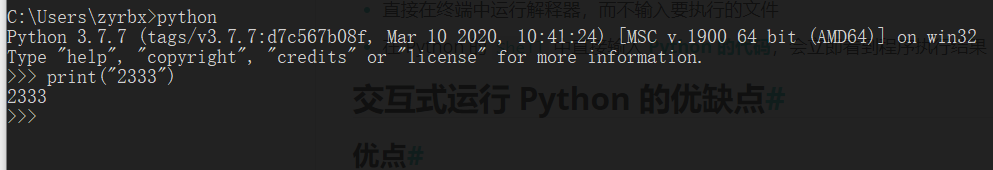

# 交互式运行

- 直接在终端中运行解释器，而不输入要执行的文件
- 在 Python 的 `Shell` 中直接输入 **Python 的代码**，会立即看到程序执行结果

## 交互式运行 Python 的优缺点

### 优点

- 适合于学习/验证 Python 语法或者局部代码

### 缺点

- 代码不能保存
- 不适合运行太大的程序

运行示例；




## 退出官方的解释器

1. 直接输入 `exit()`

2. 使用热键退出

在 python 解释器中，按热键 `ctrl + d` 可以退出解释器。

## IPython

IPython是一个第三方交互式运行方案。IPython 中 的 `“I”` 代表 **交互 interactive**

### 特点

- IPython 是一个 python 的 **交互式 shell**，比默认的 `python shell` 好用得多
  - 支持自动补全
  - 自动缩进
  - 支持 `bash shell` 命令
  - 内置了许多很有用的功能和函数
- IPython 是基于 BSD 开源的

## 安装

```bash
$ sudo apt install ipython
```

## 不同版本python对应的交互式shell

| python版本 | 交互式shell  |
| ---------- | ------------ |
| Python 2.x | **ipython**  |
| Python 3.x | **ipython3** |

### 退出交互式Shell

1.  直接输入 `exit`
2. 使用热键退出，在 IPython 解释器中，按热键 `ctrl + d`，`IPython` 会询问是否退出解释器